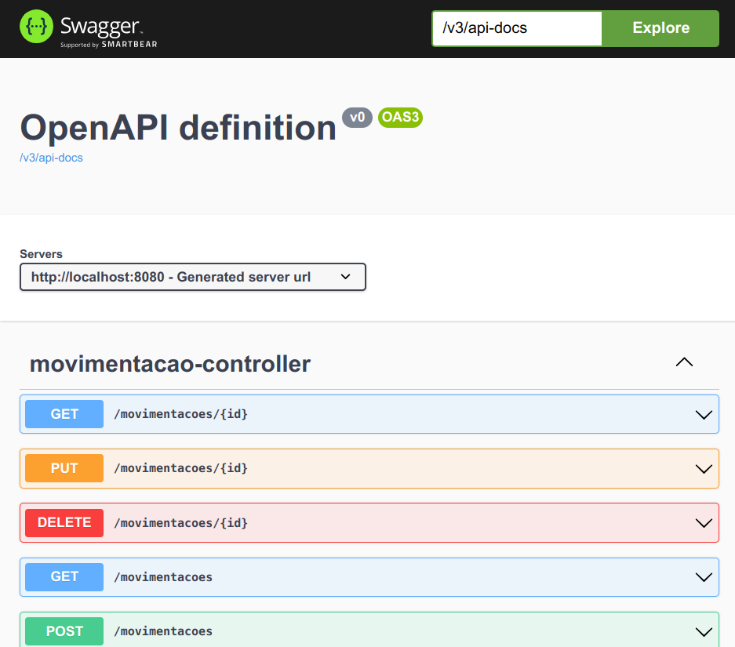

# API Banking
[](https://github.com/schambeck/api-banking/actions/workflows/maven.yml)
[](https://sonarcloud.io/summary/new_code?id=schambeck_api-banking)

> Banking Service application.



## Tech Stack

- Java 17
- Spring Boot
- Spring Security: OAuth2, SSO, Keycloak
- PostgreSQL, Flyway
- Swagger
- JUnit, Mockito, JaCoCo

## Running project

### Start infra (PostgreSQL)
To start the PostgreSQL database, follow these steps:
```bash
$ make compose-up-postgres
```

### 🚀 Build artifact
To build the application, follow these steps:
```bash
$ make dist
```

### ☕ Run backend
To run the application, follow these steps:
```bash
$ make run
```

Open Swagger - http://localhost:8080/swagger-ui.html

### Run application in Docker
To run the backend and database through Docker, follow these steps:
```bash
$ make dist-docker-build
$ make compose-up
```

### Unit Tests
To run the unit tests, follow these steps:
```bash
$ make test
```

### Coverage Report with JaCoCo
To generate the coverage report, follow these steps:
```bash
$ make jacoco-report
```

Open report - ./target/site/jacoco/index.html

### Build and run backend and keycloak
To generate the coverage report, follow these steps:
```bash
$ make kc-docker-build
$ make docker-build
$ make compose-up
```

Backend Swagger: http://localhost:8080/swagger-ui.html
Keycloak Admin Console: http://localhost:9000
